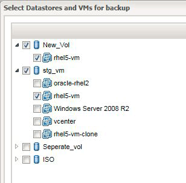

= Configuring Snap Creator for multilevel application quiesce operations when using hypervisor plug-ins
:icons: font
:imagesdir: ../media/

[.lead]
When you are using the hypervisor (also known as "`virtualization`") plug-ins (VMware (VMware vCloud Director and VMware vSphere), KVM, and Citrix XenServer) and want to perform a multilevel application quiesce and backup operation, you need to configure Snap Creator for this type of setup.

This configuration allows you to quiesce an application that resides on a virtual machine, quiesce the virtual machine, and then make a Snapshot copy.

During this process, you will create a hypervisor and application configuration by specifying a parent configuration file with one or more child configuration files. This parent configuration file contains the typical configuration file information such as retention policy, SVM details, and information for the hypervisor plug-in. Each child configuration file contains the details necessary to perform Snap Creator Quiesce and Unquiesce actions using the specific application plug-in.

. Create a new profile.
. Create a new configuration.
 .. On the Configuration page, enter a name for the configuration file.
+
NOTE: By default, password encryption is enabled to prevent passwords from being displayed in clear text in the configuration file.

 .. On the Plug-In Type page, select *Virtualization plug-in*.
 .. On the Virtualization Plug-In page, select the plug-in to configure.
 .. On the plug-in parameters page, provide the configuration details associated with the selected plug-in option.
+
In the following example, VMware vSphere is the selected Virtualization plug-in. The wizard screens that display depend on your selection.

  ... Provide the appropriate information and click *Add*.
+
image::../media/scf_config_multilvl_setup_1.gif[]

  ... On the New vCenter page, provide the vCenter IP and Hostname, and click *Add*.
  ... Select the applicable datastores and virtual machines for backup.
+

  ... Verify the details you entered are correct.
  ... On the Agent Configuration page, provide the VMware agent details, which are the details of the system where you have installed the agent.
+
NOTE: The Port is the port on which the agent is listening.
+
Click *Test agent connection* to make sure that the agent is running.

  ... On the Hypervisor + App Backup page, select *Yes* because both the hypervisor and application-consistent backups are required.
  ... On the Hypervisor + App configuration page, provide the parent configuration name for the hypervisor and application configuration.
  ... On the Plug-in Type page, select *Application plug-in*.
  ... On the Application Plug-ins page, select the application to be used for backup and restore.
  ... Provide the details for the selected application.
  ... On the Agent Configuration page, provide the application Snap Creator Agent details, which are the details of the application or database host on which you have installed the agent.
+
NOTE: Typically, the host is a virtual machine being backed up that has an application running on it.
+
Click *Test agent connection* to make sure that the agent is running.

  ... On the Summary page, verify the information and click *Finish*.
  ... On the Hypervisor + App page, you have the following options:
   **** To add additional applications to this configuration, click *Add* and repeat steps vii through xii in this example.
   **** To delete applications from this configuration, select the item and click *Delete*.
   **** To continue with the main Configuration wizard, click *Next*.
+
NOTE: If you have multiple applications listed, you have the option to reorder this list by moving an application up or down in the list. Applications are backed up serially, so if an application needs to be quiesced before another one in the list, you need to place the applications in the proper sequence.

 .. On the Storage Connection Settings page, provide the following information:
  *** For the *Transport* option, select *HTTPS*.
  *** For the *Controller/Vserver Port* option, leave the default setting (443).
  *** For the *Clustered ONTAP* option, select *Yes*.
image:../media/scf_config_multilvl_setup_3.gif[]
 .. On the New Controller/Vserver page, provide the controller IP address, username, and password.
 .. Provide the Snapshot copy details.
+
image::../media/scf_config_multilvl_setup_4.gif[]

 .. On the Snapshot Details Continued page, do not select the *Consistency Group* option.
 .. On the Data Protection page, do not select either of the *Data Transfer* options.
 .. Verify the information on the Summary page and click *Finish*.

*Related information*

xref:task_creating_profiles.adoc[Creating profiles]

xref:task_creating_configuration_files_using_sc_gui.adoc[Creating configuration files]
