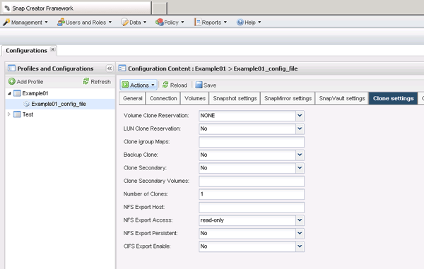

= Creating clones from a new backup
:icons: font
:imagesdir: ../media/

[.lead]
You can clone volumes or LUNs from a new Snapshot copy.

* The Snap Creator Server must be communicating with the storage system.
* You must be logged into Snap Creator with the proper permission to perform the cloning operation.

This cloning operation involves cloning a new Snapshot copy.

. From the main menu of the Snap Creator graphical user interface (GUI), select *Management* > *Configurations*.
. In the *Profiles and Configuration* pane, select a configuration file.
. Navigate to the *Clone settings* tab, and verify that the settings are set properly.
+

. Depending on the type of clone that you require, select *Actions* and one of the following options:
 ** LUN Clone
 ** Volume Clone
. In the Additional Parameters dialog box, select the appropriate policy, and then click *OK* to start the cloning process.
. In the *Console* pane, verify that the cloning process was successful.
