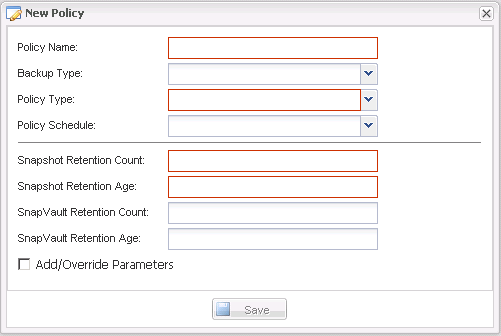

= Creating policies
:icons: font
:imagesdir: ../media/

[.lead]
You can create a new retention policy by using the Snap Creator GUI to configure multiple Snapshot policies with different retention count.

You should understand the guidelines for defining Snap Creator policies.

. From the Snap Creator GUI main menu, select *Policy* > *Policy Management*.
. From the *Policy Manager* tab, click *Create*.
. Enter the details, and then click *Save*.
+

+
|===
| Field| Description
a|
Policy Name
a|
Specify the name of the policy.
a|
Backup Type
a|
(Optional) Select the backup type.
a|
Policy Type
a|
Select the policy type:

 ** *LOCAL*
+
Takes a Snapshot copy on the primary storage. Select this type if there are no SnapMirror or SnapVault relationships.

 ** SNAPVAULT
+
Creates a Snapshot copy on the primary storage and performs a SnapVault update. SnapVault update must be enabled for all volumes in the configuration.

 ** SNAPMIRROR
+
Creates a Snapshot copy on the primary storage and performs a SnapMirror update. SnapMirror update must be enabled for all volumes in the configuration.

a|
Policy Schedule
a|
(Optional) Select the policy schedule to be used. If no policy schedule is specified, these actions do not run automatically.
a|
Snapshot Retention Count
a|
Enter the number of backups to be retained.
a|
Snapshot Retention Age
a|
Enter the minimum age that the backups must be retained before they can be deleted.
a|
SnapVault Retention Count
a|
If you selected SnapVault as the policy type, enter the retention count for SnapVault.
a|
SnapVault Retention Age
a|
If you selected SnapVault as the policy type, enter the retention age for SnapVault.
a|
Add/Override Parameters
a|
Certain parameters can be overridden for a policy. If desired, select this check box, and then add the parameters to be overridden.
|===
