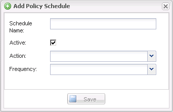

= Creating policy schedules
:icons: font
:imagesdir: ../media/

[.lead]
You can optionally create policy schedules by using the Snap Creator GUI.

. From the Snap Creator GUI main menu, select *Policy* > *Policy Schedules*.
. From the *Policy Schedules* tab, click *Create*.
. Enter the schedule name and select the action and frequency, and then click *Save*.
+
Depending on the frequency you select, you will need to select the appropriate time fields for running the scheduled job.
+

