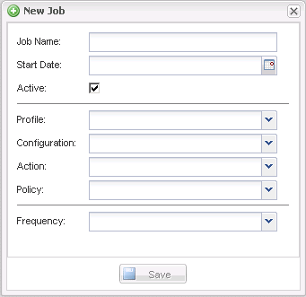

= Creating scheduled jobs
:icons: font
:imagesdir: ../media/

[.lead]
If you are using a local retention policy (located in the configuration file), you can use the Snap Creator graphical user interface (GUI) scheduler to create schedules and run tasks. The scheduler--which is contained within Snap Creator Server--can schedule backups (Snapshot copies), LUN clones, volume clones, application-defined clones, Open Systems SnapVault (OSSV) transfers, archive jobs, and custom actions.

If you plan to use policy objects instead of a local retention policy, you should skip this procedure and create a policy schedule instead.

. From the main menu of the Snap Creator GUI, select *Management* > *Schedules* and click *Create*.
. In the New Job window, enter the details for the job.
+

+
[options="header"]
|===
| Field| Description
a|
Job Name
a|
Specify the name of the scheduled job.
a|
Start Date
a|
Select today's date or a future date.
a|
Active
a|
Set to Active to signify that the job will run as scheduled.    Active is the default setting.
a|
Profile
a|
Select the profile to be associated with this job.
a|
Configuration
a|
Select the configuration to be associated with this job.
a|
Action
a|
Select one of the following options:

 ** *Backup*: Creates a backup by using NetApp storage technology.
 ** *CloneLun*: Creates a backup and clones one or more LUNs by using the lun clone command.
 ** *CloneVol*: Creates a backup and clones a volume.
 ** *Clone*: Performs a plug-in-driven clone operation.
 ** *OSSV*: Uses Open Systems SnapVault to perform the backup.
+
No primary backup is created.

 ** *Arch*: Performs archive log management only.
+
No backup is created.

 ** *Custom*: Executes a plug-in-defined cloning action.

a|
Policy
a|
Select the policy to be associated with this job.
a|
Frequency
a|
Select the frequency for this job.     Depending on your selection, you must select the appropriate time fields for running the scheduled job.
+
|===

. Click *Save*.

*Related information*

xref:task_creating_policy_schedules.adoc[Creating policy schedules]
