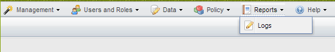

= Monitoring logs
:icons: font
:imagesdir: ../media/

[.lead]
You can view the logs for every profile and configuration by using the Snap Creator GUI.

You can view the Out, Debug, Error, and Stderr logs to assist in troubleshooting operations. See the related references for more information about these troubleshooting logs.

. From the Snap Creator GUI main menu, select *Reports* > *Logs*:
+

. Select logs by profile, configuration file, log type, or specific log, as necessary:
+
image::../media/reports_logs_example.gif[]
+
The selected log can also be downloaded by clicking *Download Selected Log*. The downloaded log file is stored in the directory (or folder) that is specified by the browser for downloads.
+
NOTE: The out, debug, stderr, and agent logs are retained as defined by the LOG_NUM value in the configuration file, but the error log is always appended.

*Related information*

xref:reference_logs.adoc[Types of error messages and troubleshooting logs]
