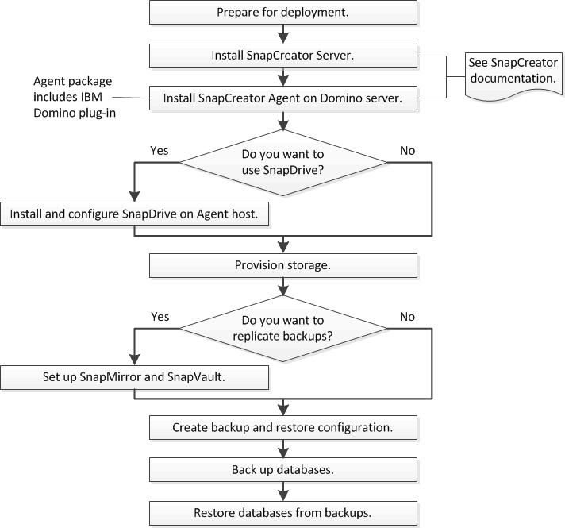

= IBM Domino backup and recovery workflow
:icons: font
:imagesdir: ../media/

[.lead]
Before you can create backups with the IBM Domino plug-in, you need to install the Snap Creator Server and Agent software and provision NetApp storage. If you plan to replicate Snapshot copies to secondary storage for disaster recovery and archiving, you need to set up SnapMirror and SnapVault relationships.

NOTE: Especially in a SAN environment, you might want to use SnapDrive on the Snap Creator Agent host to back up databases or to mount Snapshot copies for single-file restores. For more information, see xref:concept_adding_commands_to_the_backup_and_restore_configuration.adoc[Adding commands to the backup and restore configuration] and xref:concept_single_file_restore_in_fc_iscsi_environments.adoc[Performing a single-file restore in a SAN environment].

