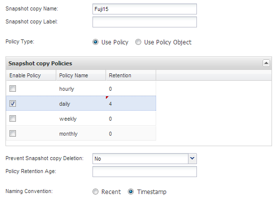

= Creating a configuration file
:icons: font
:imagesdir: ../media/

[.lead]
Before you can back up IBM Domino databases, you need to create a configuration file. The configuration file is the input for Snap Creator backup and restore operations.

Only alphanumeric and underscore characters are allowed in configuration and profile names. Names cannot start with a number.

TIP: Many sites use a profile-wide or site-wide global configuration file to apply storage system or VMware credential information to backup and restore configurations. For details about how to create a global configuration file, see the https://library.netapp.com/ecm/ecm_download_file/ECMP12395422[Snap Creator Framework 4.1.2 Administration Guide].

. In the Profiles and Configurations pane, click *Add Profile*.
. In the New Profile dialog box, enter the name of the profile, and then click *OK*.
+
Creating a new profile automatically launches the Snap Creator Framework Configuration wizard. To add a new configuration to an existing profile, right-click the profile, and then select *New Configuration*.
+
Throughout the Configuration wizard, click *Next* to advance to the next page and click *Back* to return to the previous page.

. On the Configuration page, enter the name of the configuration, and then specify whether you want to enable password encryption.
+
Password encryption is enabled by default to prevent passwords from being displayed in clear text in the configuration file.
+
TIP: Hover over a field in the wizard to display a tool tip.

. On the Plug-in Type page, select *Application plug-in*.
. On the Application Plug-ins page, select *IBM Domino*.
. On the Plug-in parameters page, specify IBM Domino backup configuration details:
+
NOTE: The examples in the following table are for UNIX environments. You can view examples of the settings for Windows in the screenshot that follows the table.
+
[options="header"]
|===
| GUI parameter| CLI parameter| Description
a|
Domino Data Directory
a|
DOMINO_DATA_ PATH
a|
The path to the Domino data directory. For example, /Domino/data.
a|
notes.ini Path
a|
DOMINO_INI_PATH
a|
The path to the notes.ini file. For example, /Domino/data/notes.ini.
a|
Change info Directory
a|
DOMINO_CHANGE_ INFO_PATH
a|
The path to changeinfo files. For example, /changeinfo.    *Important:* Make sure that you store changeinfo files on a volume other than the Domino data volume.
a|
Backup Type
a|
DOMINO_ DATABASE_TYPE
a|
The database files to be backed up. Select a value from the GUI drop-down, or specify the corresponding number in the CLI command:

 ** Everything (recommended) (CLI = 0)
 ** *.box files (CLI= 1)
 ** *.nsf, *.nsg, and *.nsh files (CLI = 2)
 ** *.ntf files (CLI = 3)

a|
IBM Domino installation directory
a|
LOTUS
a|
The path to the directory where Domino binary files are installed. In Linux, for example, /opt/ibm/domino (assuming the default installation path). In Windows, the parent of the Domino Shared Objects directory.     *Note:* This is not the path to IBM Notes, formerly Lotus Notes.
a|
Path to Domino shared objects
a|
Notes_ExecDirectory
a|
The path that contains Domino shared object files (.so or .dll). For example, /opt/ibm/domino/notes/latest/linux.
a|
Data Restore Directory
a|
DOMINO_ RESTORE_DATA_ PATH
a|
For volume restores (assuming you are restoring to the same location from which you took the backup), the Domino data directory path.    For single-file restores (NFS only), a location on the same volume as the Domino Data Directory. For example, /Domino/data/restore.
a|
Validate Domino Data Directory
a|
VALIDATE_ DOMINO_DATA_ PATH
a|
If the Domino environment has multiple mount points, some mount points might be on NetApp storage, while others might not be. Select a value from the GUI drop-down, or specify the corresponding value in the CLI command:

 ** Yes backs up files on the Domino data directory path only.
 ** No backs up all files in the Domino environment regardless of their location on disk.

+
|===
The following example shows how you might complete the fields in a Windows environment:
+
image::../media/scfs_domino_param_filled_in_windows.gif[This image is explained by the surrounding text.]

. On the Agent Configuration page, specify Snap Creator Agent connection information:
+
[options="header"]
|===
| For this field...| Do this...
a|
IP/DNS
a|
Enter the IP address or DNS host name of the Snap Creator Agent host.
a|
Port
a|
If you are not using the default port for the Snap Creator Agent (9090), enter the port number.
a|
Timeout (secs)
a|
Leave the default.
|===

. When you are satisfied with your entries, click *Test agent connection* to verify the connection to the Agent.
+
NOTE: If the Agent is not responding, verify the Agent details and confirm that host name resolution is working correctly.

. On the Storage Connection settings page, specify connection information for the Storage Virtual Machine (SVM, formerly known as Vserver) on the primary storage system:
+
[options="header"]
|===
| For this field...| Do this...
a|
Transport
a|
Select the transport protocol for communications with the SVM: HTTP or HTTPS.
a|
Controller/Vserver Port
a|
If you are not using the default port for the SVM (80 for HTTP, 443 for HTTPS), enter the port number.
|===
*Note:* For information about how to use an OnCommand proxy, see the https://library.netapp.com/ecm/ecm_download_file/ECMP12395422[Snap Creator Framework 4.1.2 Administration Guide].

. On the Controller/Vserver Credentials page, specify the credentials for the SVM on the primary storage system:
+
[options="header"]
|===
| For this field...| Do this...
a|
Controller/Vserver IP or Name
a|
Enter the IP address or DNS host name of the SVM host.
a|
Controller/Vserver User
a|
Enter the user name for the SVM host.
a|
Controller/Vserver Password
a|
Enter the password for the SVM host.
|===
*Important:* If you are planning to replicate Snapshot copies to a SnapMirrror or SnapVault destination, the name of the SVM you enter in this step must match exactly the name of the SVM you used when you created the SnapMirrror or SnapVault relationship. If you specified a fully qualified domain name when you created the relationship, you must specify a fully qualified domain name in this step, regardless of whether SnapCreator can find the SVM with the information you provide. Case is significant.
+
You can use the snapmirror show command to check the name of the SVM on the primary storage system:snapmirror show -destination-path destination_SVM:destination_volume where destination_SVM_name is the name of the SVM on the destination system and destination_volume is the volume. For more information about creating SnapMirrror and SnapVault relationships, see xref:concept_snapmirror_and_snapvault_setup.adoc[SnapMirror and SnapVault setup].
+
When you click *Next*, the Controller/Vserver Volumes window is displayed.

. In the Controller/Vserver Volumes window, specify the volumes to be backed up by dragging and dropping from the list of available volumes in the left pane to the list of volumes to be backed up in the right pane, and then click *Save*.
+
The specified volumes are displayed on the Controller/Vserver Credentials page.
+
IMPORTANT: If you plan to back up the changeinfo directory, you must configure the volume containing the directory as a metadata volume, as described in xref:concept_use_meta_data_volumes_setting_to_back_up_the_changeinfo_directory.adoc[Backing up the changeinfo directory]. This option tells the IBM Domino plug-in to create a Snapshot copy of the changeinfo volume _after_ creating the Snapshot copy for database files.

. On the Controller/Vserver Credentials page, click *Add* if you want to specify SVM details and volumes to be backed up for another primary storage system.
. On the Snapshot details page, specify Snapshot configuration information:
+
[options="header"]
|===
| For this field...| Do this...
a|
Snapshot Copy Name
a|
Enter the name of the Snapshot copy.    *Tip:* Click *Allow Duplicate Snapshot Copy Name* if you want to reuse Snapshot copy names across configuration files.
a|
Snapshot Copy Label
a|
Enter descriptive text for the Snapshot copy.
a|
Policy Type
a|
Click *Use Policy*, and then select the built-in backup policies you want to make available for this configuration. After you select a policy, click in the *Retention* cell to specify how many Snapshot copies with that policy type you want to retain.    *Note:* For information about how to use policy objects, see the https://library.netapp.com/ecm/ecm_download_file/ECMP12395422[Snap Creator Framework 4.1.2 Administration Guide].
a|
Prevent Snapshot Copy Deletion
a|
Specify Yes only if you do not want Snap Creator to automatically delete Snapshot copies that exceed the number of copies to be retained.     *Note:* Specifying Yes might cause you to exceed the number of supported Snapshot copies per volume.
a|
Policy Retention Age
a|
Specify the number of days you want to retain Snapshot copies that exceed the number of copies to be retained. You can specify a retention age per policy type by entering policy type:age, for example, daily:15.
a|
Naming Convention
a|
Leave the default.
|===
The configuration specified in the following example performs a daily backup and retains four Snapshot copies:
+

. On the Snapshot details continued page, set *Ignore Application Errors* to Yes if you want to force the backup operation to proceed even if one or more databases are in an inconsistent or corrupted state.
+
You should ignore the remaining fields.
+
TIP: A Domino environment might consist of hundreds or thousands of databases. If even a single database is in an inconsistent or corrupted state, the backup will fail. Enabling *Ignore Application Errors* allows the backup to continue.

. On the Data Protection page, specify whether you want to perform optional Snapshot copy replication to secondary storage:
 .. Click *SnapMirror* to mirror Snapshot copies.
+
The policy for mirrored Snapshot copies is the same as the policy for primary Snapshot copies.

 .. Click *SnapVault* to archive Snapshot copies.
 .. Specify the policy for archived Snapshot copies.
 .. The instructions are in the following step<<STEP_81795CF9D6294AC891BC3D0CE4827CA3,13>>.
 .. In *SnapVault wait time*, enter the number of minutes you want Snap Creator to wait for the SnapVault operation to complete.
 .. You need to have set up SnapMirror and SnapVault relationships before performing replication to secondary storage. For more information, see xref:concept_snapmirror_and_snapvault_setup.adoc[SnapMirror and SnapVault setup].
. On the Data Protection Volumes page, click *Add*, and then select the SVM for the primary storage system.
+
When you click *Next*, the Data Protection Volume Selection window is displayed.

. In the Data Protection Volume Selection window, specify the source volumes to be replicated by dragging and dropping from the list of available volumes in the left pane to the list of volumes in the SnapMirror and/or SnapVault areas in the right pane, and then click *Save*.
+
The specified volumes are displayed on the Data Protection Volumes page.

. On the Data Protection Volumes page, click *Add* if you want to specify SVM details and volumes to be replicated for another primary storage system.
. On the Data protection relationships page, specify the credentials for the SVM on the SnapMirrror and/or SnapVault destination systems.
. If you prefer to use NetAppOnCommand Unified Manager APIs instead of Data ONTAP APIs for Snapshot copies and SnapMirror/SnapVault updates, complete the fields on the DFM/OnCommand Settings page:
 .. Click *Operations Manager Console Alert* if you want to receive Unified Manager alerts, and then enter the required connection information for the Unified Manager virtual machine.
 .. Click *NetApp Management Console data protection capability* if you are using the NetApp Management Console data protection feature for 7-Mode SnapVault replication, and then enter the required connection information for the Unified Manager virtual machine.
. Review the summary, and then click *Finish*.

Snap Creator lists the configuration file below the specified profile in the Profiles and Configurations pane. You can edit the configuration by selecting the configuration file and clicking the appropriate tab in the Configuration Content pane. You can rename the configuration by clicking *Rename* in the right-click menu. You can delete the configuration by clicking *Delete* in the right-click menu.
