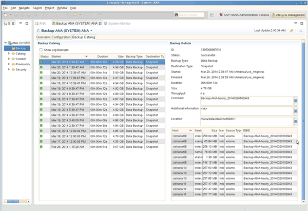

= Reviewing available backups in SAP HANA Studio
:icons: font
:imagesdir: ../media/

[.lead]
You can see the list of storage Snapshot backups in the SAP HANA Studio.

The highlighted backup in the following figure shows a Snapshot copy named "`Backup-ANA_hourly_20140320103943.`" This backup includes Snapshot copies for all three data volumes of the SAP HANA system. The backup is also available at the secondary storage.

image::../media/sap_hana_backup_list_scfw_gui.gif[This image is explained by the surrounding text.]

The Snapshot copy name is used by Snap Creator as a backup ID when Snap Creator registers the storage Snapshot copy in the SAP HANA backup catalog. Within the SAP HANA Studio, the storage Snapshot backup is visible in the backup catalog. The external backup ID (EBID) has the same value as the Snapshot copy name as shown in the following figure.

With every backup run, Snap Creator deletes Snapshot backups at the primary and at the secondary storage based on the retention policies defined for the different schedules (hourly, daily, and so on).

Snap Creator also deletes the backups within the SAP HANA backup catalog if the backup does not exist at the primary or secondary storage. The SAP HANA backup catalog always shows the complete list of backups that are available at the primary and/or the secondary storage.
