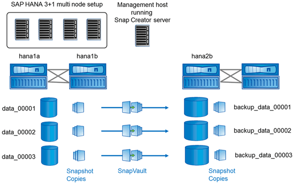

= Setup assumptions in this guide
:icons: font
:imagesdir: ../media/

[.lead]
Though a typical Snap Creator installation assumes that the Server is installed on one host and the Agent is installed on a different host, the setup used in this guide is based on an SAP HANA multinode appliance.

In this configuration, the SAP HANA database runs on a 3+1 database node configuration and all Snap Creator software components--Server, Agent, and plug-in--are installed on the same host.

The NetApp storage systems used in this setup are running Data ONTAP operating in 7-Mode. One high-availability (HA) controller pair is used on the storage layer. The data and log volumes of the three SAP HANA database nodes are distributed to both storage controllers. With the example setup, one storage controller of another HA controller pair is used as the secondary storage. Each data volume is replicated to a dedicated backup volume on the secondary storage. The size of the backup volumes depend on the number of backups that will be kept at the secondary storage.

All Snap Creator and SAP HANA Studio operations described here are the same with storage systems running clustered Data ONTAP. However, the initial SnapVault configuration on the storage systems and all SnapVault commands that need to be executed directly on the storage are different with clustered Data ONTAP. The differences are highlighted and described in this guide.

The following figure shows the data volumes on the primary storage and the replication path to the secondary storage:

NOTE: All volumes that need to be backed up must be created on the secondary storage controller. In this example, the volumes backup_data_00001, backup_data_00002, and backup_data_00003 are created on the secondary storage controller.
