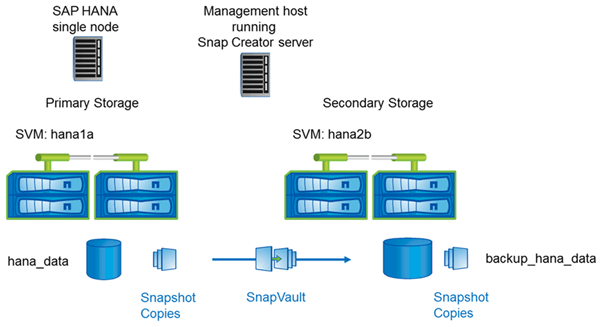

= Setup used with clustered Data ONTAP
:icons: font
:imagesdir: ../media/

The following figure shows the setup that has been used with clustered Data ONTAP. The setup is based on a single-node SAP HANA configuration with the storage virtual machines (SVMs) and volume names shown in the following illustration.

The way you prepare, start, resume, and restore SnapVault operations is different in clustered Data ONTAP and Data ONTAP operating in 7-Mode. These differences are called out in the corresponding sections of this guide.
