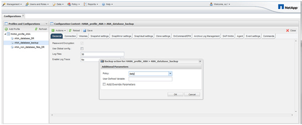

= Backing up the database with the Snap Creator GUI
:icons: font
:imagesdir: ../media/

[.lead]
You can back up a database with the Snap Creator GUI.

. Select the *HANA_database_backup configuration* and then select *Actions* > *Backup*.
+
image::../media/sap_hana_db_backup.gif[This image is explained by the surrounding text.]

. Select the backup policy and click *OK*.
+

+
The backup starts. Snap Creator triggers the "`SnapVault update,`" and Snap Creator waits until the data is replicated to the secondary storage. The wait time has been configured during the configuration and can be adapted in the SnapVault settings tab. Snap Creator triggers the SnapVault updates in parallel for each volume on the same storage controller, but in sequence for each storage controller.
+
image::../media/sap_hana_database_backup2_scfw_gui.gif[This image is explained by the surrounding text.]
