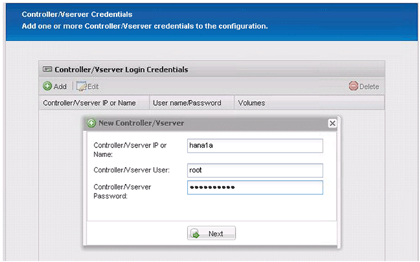
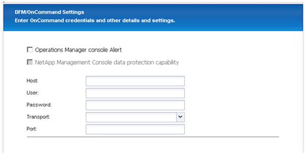

= Configuring the Snap Creator Framework and SAP HANA database backup
:icons: font
:imagesdir: ../media/

[.lead]
You must configure the Snap Creator Framework and the SAP HANA database backup.

. Connect to the Snap Creator graphical user interface (GUI): https://host:8443/ui/.
. Log in using the user name and password that were configured during the installation. Click *Sign in*.
+
image::../media/snap_creator_gui.gif[Shows the Snap Creator GUI login]

. Enter a profile name and click *OK*.
+
image::../media/sap_hana_user_profile.gif[]
+
For example, "`ANA`" is the SID of the database.

. Enter the configuration name, and click *Next*.
+
image::../media/sap_hana_gui_for_configuration_name.gif[Shows the configuration name entered in the field]

. Select *Application plug-in* as the plug-in type, and click *Next*.
+
image::../media/sap_hana_config_plugin_type.gif[shows select application plug-in]

. Select *SAP HANA* as the application plug-in, and click *Next*.
+
image::../media/sap_hana_select_application_plug_in.gif[]

. Enter the following configuration details:
 .. Select *Yes* from the drop-down menu to use the configuration with a multitenant database. For a single container database select *No*.
 .. If Multitenant Database Container is set to *No*, you must provide the database SID.
 .. If Multitenant Database Container is set to *Yes*, you must add the hdbuserstore keys for each SAP HANA node.
 .. Add the name of the tenant database.
 .. Add the HANA nodes on which the hdbsql statement must be executed.
 .. Enter the HANA node instance number.
 .. Provide the path to the hdbsql executable file.
 .. Add the OSDB user.
 .. Select *Yes* from the drop-down list to Enable LOG Cleanup.
+
NOTE:

  *** Parameter `HANA_SID` is available only if the value for parameter `HANA_MULTITENANT_DATABASE` is set to `N`
  *** For multitenant database containers (MDC) with a "`Single Tenant`" resource type, the SAP HANA Snapshot copies work with UserStore Key based authentication. If the `HANA_MULTITENANT_DATABASE` parameter is set to `Y`, then the `HANA_USERSTORE_KEYS` parameter must be set to the appropriate value.
  *** Similar to non-multitenant database containers, the file-based backup and integrity check feature is supported

 .. Click *Next*.

+
image::../media/file_based_backup_configuration.gif[]
. Enable the File-Based Backup operation:
 .. Set the File-Backup Location.
 .. Specify the file-backup prefix.
 .. Select the *Enable File-Backup* checkbox.
 .. Click *Next*.
+
image::../media/enable_file_based_backup.gif[]
. Enable the Database Integrity Check operation:
 .. Set the temporary File-Backup location.
 .. Select the *Enable DB Integrity Check* checkbox.
 .. Click *Next*.

+
image::../media/integrity_checks.gif[Database Integrity Check]
. Enter the details for the agent configuration parameter, and click *Next*.
+
image::../media/sap_hana_agent_configuration_parameter.gif[This image is explained by the surrounding text.]

. Enter the storage connection settings, and click *Next*.
+
image::../media/sap_hana_storage_connect_gui.gif[This image is explained by the surrounding text.]

. Enter the storage login credentials, and click *Next*.
+

. Select the data volumes that are stored on this storage controller, and click *Save*.
+
image::../media/sap_hana_select_data_volumes.gif[This image is explained by the surrounding text.]

. Click *Add* to add another storage controller.
+
image::../media/sap_hana_add_controller.gif[This image is explained by the surrounding text.]

. Enter the storage login credentials, and click *Next*.
+
image::../media/sap_hana_storage_login_credentials2.gif[This image is explained by the surrounding text.]

. Select the data volumes that are stored on the second storage controller that you created, and click *Save*.
+
image::../media/sap_hana_controller_volumes_selection.gif[This image is explained by the surrounding text.]

. The Controller/Vserver Credentials window displays the storage controllers and volumes that you added. Click *Next*.
+
image::../media/sap_hana_view_storage_credentials.gif[This image is explained by the surrounding text.]

. Enter the Snapshot policy and retention configuration.
+
The retention of three daily and eight hourly Snapshot copies is just an example and could be configured differently depending on the customer requirements.
+
NOTE: Select *Timestamp* as the naming convention. The use of the naming convention *Recent* is not supported with the SAP HANA plug-in, because the timestamp of the Snapshot copy is also used for the SAP HANA backup catalog entries.
+
image::../media/sap_hana_snapshot_details_gui.gif[This image is explained by the surrounding text.]

. No changes required. Click *Next*.
+
image::../media/sap_hana_snapshot_details_continued_gui.gif[This image is explained by the surrounding text.]

. Select *SnapVault*, and configure the SnapVault retention policies and the SnapVault wait time.
+
image::../media/sap_hana_data_protection_gui.gif[This image is explained by the surrounding text.]

. Click *Add*.
+
image::../media/sap_hana_data_protection_volumes.gif[This image is explained by the surrounding text.]

. Select a source storage controller from the list, and click *Next*.
+
image::../media/sap_hana_dp_volumes_gui_select_storage_controller.gif[This image is explained by the surrounding text.]

. Select all the volumes that are stored on the source storage controller, and click *Save*.
+
image::../media/sap_hana_volume_selection_gui.gif[This image is explained by the surrounding text.]

. Click *Add*, and select the second source storage controller from the list, and then click *Next*.
+
image::../media/sap_hana_configuration_data_protection_volumes_select_controller.gif[This image is explained by the surrounding text.]

. Select all the volumes that are stored on the second source storage controller, and click *Save*.
+
image::../media/sap_hana_data_protection_volume_selection.gif[This image is explained by the surrounding text.]

. The Data Protection Volumes window displays all the volumes that should be protected in the configuration that you created. Click *Next*.
+
image::../media/sap_hana_data_protection_volumes_gui.gif[This image is explained by the surrounding text.]

. Enter the credentials for the target storage controllers, and click *Next*. In this example, the "`root`" user credentials are used to access the storage system. Typically, a dedicated backup user is configured on the storage system and is then used with Snap Creator.
+
image::../media/sap_hana_data_protection_relationships_gui.gif[This image is explained by the surrounding text.]

. Click *Next*.
+

. Click *Finish* to complete the configuration.
+
image::../media/sap_hana_data_protection_configuration_summary.gif[This image is explained by the surrounding text.]

. Click the *SnapVault settings* tab.
. Select *Yes* from the drop-down list of the *SnapVault Restore Wait* option, and click *Save*.
+
image::../media/sap_hana_snapvault_settings_gui.gif[This image is explained by the surrounding text.]
+
It is recommended that you use a dedicated network for replication traffic. If you decide to do so, you should include this interface in the Snap Creator configuration file as a secondary interface.
+
You can also configure dedicated management interfaces so that Snap Creator can access the source or the target storage system by using a network interface that is not bound to the storage controller's host name.
+
----
mgmtsrv01:/opt/NetApp/Snap_Creator_Framework_411/scServer4.1.1c/engine/configs/HANA_profile_ANA
# vi ANA_database_backup.conf

#####################################################################
########################
#     Connection Options                                            #
#####################################################################
########################
PORT=443
SECONDARY_INTERFACES=hana1a:hana1a-rep/hana2b;hana1b:hana1b-rep/hana2b
MANAGEMENT_INTERFACES=hana2b:hana2b-mgmt
----
