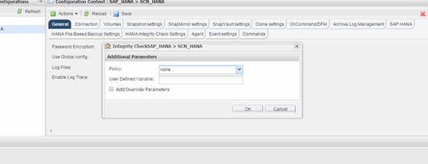

= Performing Database Integrity Checks from Snap Creator GUI
:icons: font
:imagesdir: ../media/

[.lead]
You can perform Database Integrity Checks from the Snap Creator graphical user interface (GUI).

You must have enabled the DB Integrity Check parameter in the HANA Integrity Check Settings tab.

. Select the HANA_database_integrity_check configuration.
. Select *Actions* > *Integrity Check*.
+
image::../media/performing_file_based_backup_with_gui.gif[Performing File-Based Backup with GUI]

. Set the Policy option to *None*, and click *OK*.
+

