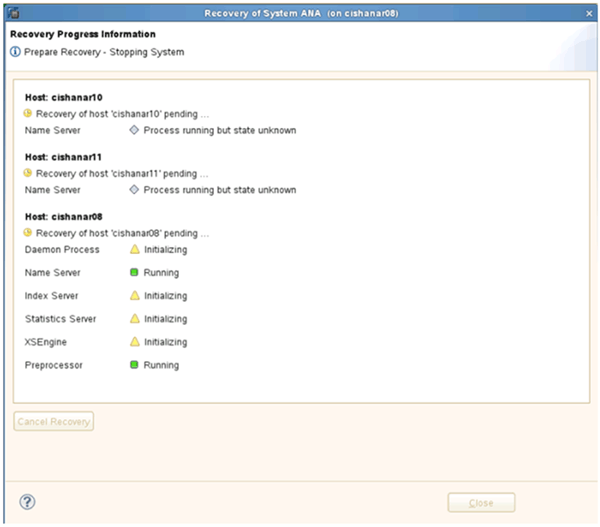

= Restoring and recovering databases from secondary storage
:icons: font
:imagesdir: ../media/

[.lead]
You can restore and recover the database from the secondary storage.

. Within SAP HANA Studio, select *Recover* for the SAP HANA system.
+
image::../media/sap_hana_recovery_secondary_storage_gui.gif[This image is explained by the surrounding text.]
+
The SAP HANA system will be shut down.

. Select the recovery type and click *Next*.
+
image::../media/sap_hana_secondary_specify_recovery_type.gif[This image is explained by the surrounding text.]

. Provide log backup locations and click *Next*.
+
image::../media/sap_hana_secondary_log_backup_locations.gif[This image is explained by the surrounding text.]
+
The list of available backups appear based on the content of the backup catalog.

. Select the required backup and write down external backup ID.
+
image::../media/sap_hana_recover_secondary_select_backup.gif[This image is explained by the surrounding text.]

. Go to the Snap Creator GUI.
. Select the SAP HANA system, and then click *Actions* > *Restore*.
+
image::../media/sap_hana_secondary_select_backup_restore.gif[This image is explained by the surrounding text.]
+
The Welcome screen appears.
+
image::../media/sap_hana_secondary_welcome_screen.gif[This image is explained by the surrounding text.]

. Click *Next*.
. Select *Secondary* and click *Next*.
+
image::../media/sap_hana_secondary_restore.gif[This image is explained by the surrounding text.]

. Enter the required information. The Snapshot name correlates with the backup ID that has been selected in SAP HANA Studio.
+
image::../media/sap_hana_select_backup_restore04_secondary_scf_gui.gif[This image is explained by the surrounding text.]

. Select *Finish*.
+
image::../media/sap_hana_secondary_restore_summary.gif[This image is explained by the surrounding text.]

. Click *Yes* to add more items to restore.
+
image::../media/sap_hana_secondary_snapshot_settings_warning.gif[This image is explained by the surrounding text.]

. Provide the required information for all volumes that need to be restored. In the setup data_00001, data_00002, and data_00003 need to be selected for the restore process.
+
image::../media/sap_hana_secondary_snapvault_restore.gif[This image is explained by the surrounding text.]

. When all volumes are selected, select *OK* to start the restore process.
+
Wait until the restore process is finished.

. On each database node remount all data volumes to clean "`Stale NFS Handles.`"
+
In the example, all three volumes need to be remounted at each database node.
+
----
mount -o remount /hana/data/ANA/mnt00001
mount -o remount /hana/data/ANA/mnt00002
mount -o remount /hana/data/ANA/mnt00003
----

. Go to SAP HANA Studio and click *Refresh* to update the backup list.
+
image::../media/sap_hana_secondary_select_backup_to_recover.gif[This image is explained by the surrounding text.]

. The backup that has been restored with Snap Creator is shown with a green icon in the list of backups. Select the backup and click *Next*.
. Select other settings as required and click *Next*.
+
image::../media/sap_hana_secondary_other_settings.gif[This image is explained by the surrounding text.]

. Click *Finish*.
+
image::../media/sap_hana_secondary_review_recovery_settings.gif[This image is explained by the surrounding text.]
+
The recovery process begins.
+

. After the recovery process is finished, resume the SnapVault Relationships, if required.
+
image::../media/sap_hana_secondary_recovery_execution_summary.gif[This image is explained by the surrounding text.]
