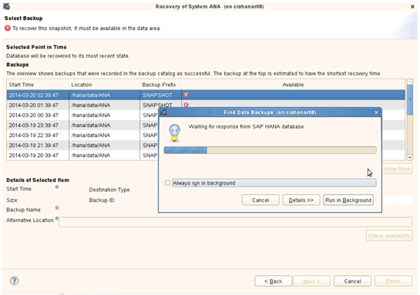
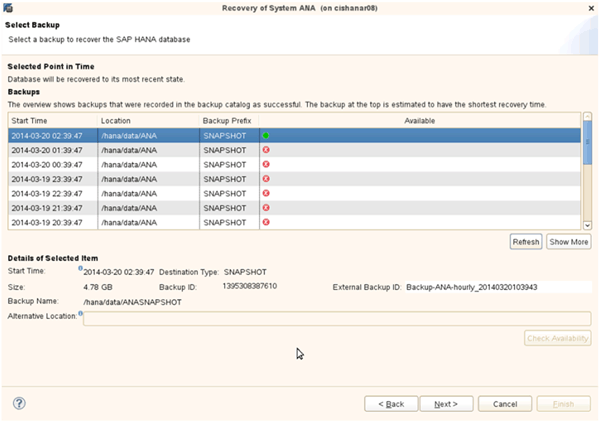
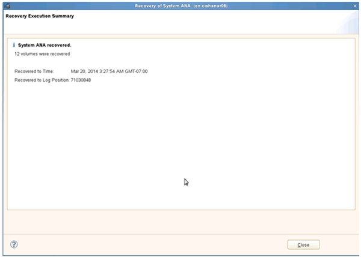

= Restoring and recovering databases from primary storage
:icons: font
:imagesdir: ../media/

[.lead]
You can restore and recover the database from the primary storage.

NOTE: You cannot restore file-based backup copies from Snap Creator.

. Within SAP HANA Studio, select *Recover* for the SAP HANA system.
+
image::../media/sap_hana_recover_primary_gui.gif[This image is explained by the surrounding text.]
+
The SAP HANA system shuts down.

. Select the recovery type and click *Next*.
+
image::../media/sap_hana_specify_recovery_type_gui.gif[This image is explained by the surrounding text.]

. Provide the log backup locations and click *Next*.
+
image::../media/sap_hana_recover_primary_log_backup_location.gif[This image is explained by the surrounding text.]
+
The list of available backups you see is based on the content of the backup catalog.

. Select the required backup and record the external backup ID.
+
image::../media/sap_hana_recovery_primary_select_backup.gif[This image is explained by the surrounding text.]

. Deactivate the SnapVault relationship.
+
NOTE: This step is only required with clustered Data ONTAP.
+
If you need to restore a Snapshot copy that is older than the Snapshot copy currently used as the base Snapshot copy for SnapVault, you must first deactivate the SnapVault relationship in clustered Data ONTAP. To do that, execute the following commands on the backup cluster console:
+
----
hana::> snapmirror quiesce -destination-path hana2b:backup_hana_data
Operation succeeded: snapmirror quiesce for destination hana2b:backup_hana_data.

hana::> snapmirror delete -destination-path hana2b:backup_hana_data
Operation succeeded: snapmirror delete the relationship with destination hana2b:backup_hana_data.

hana::> snapmirror release -destination-path hana2b:backup_hana_data
[Job 6551] Job succeeded: SnapMirror Release Succeeded
----

. In the Snap Creator GUI, select the SAP HANA system, then select *Actions* > *Restore*.
+
image::../media/sap_hana_select_restore_backup.gif[This image is explained by the surrounding text.]
+
The Welcome to the Snap Creator Framework Restore Wizard screen appears.

. Click *Next*.
+
image::../media/sap_hana_primary_restore_welcome_screen.gif[This image is explained by the surrounding text.]

. Select *Primary* and click *Next*.
+
image::../media/sap_hana_primary_restore_primary_select.gif[This image is explained by the surrounding text.]

. Select restore from primary storage.
. Select the storage controller, the volume name, and the Snapshot name.
+
The Snapshot name correlates with the backup ID that has been selected within SAP HANA Studio.
+
image::../media/sap_hana_select_backup_restore_scf_gui.gif[This image is explained by the surrounding text.]

. Click *Finish*.
+
image::../media/sap_hana_primary_restore_summary.gif[This image is explained by the surrounding text.]

. Click *Yes* to add more restore items.
+
image::../media/sap_hana_add_more_restore_items.gif[This image is explained by the surrounding text.]

. Select the storage controller, the additional volume name, and the Snapshot name.
+
The Snapshot name correlates with the backup ID that has been selected within SAP HANA Studio.
+
image::../media/sap_hana_primary_select_restore_details.gif[This image is explained by the surrounding text.]

. Repeat steps 10 through 13 until all required volumes are added; in our example, data_00001, data_00002, and data_00003 need to be selected for the restore process.
. When all volumes are selected, click *OK* to start the restore process.
+
image::../media/sap_hana_select_volume_restore.gif[This image is explained by the surrounding text.]
+
The restore process is started.
+
image::../media/sap_hana_primary_general_restore_process_in_progress.gif[This image is explained by the surrounding text.]
+
Wait until the restore process is finished.

. On each database node, remount all data volumes to clean Stale NFS Handles.
+
In the example, all three volumes need to be remounted at each database node.
+
----
mount -o remount /hana/data/ANA/mnt00001
mount -o remount /hana/data/ANA/mnt00002
mount -o remount /hana/data/ANA/mnt00003
----

. Go to SAP HANA Studio and click *Refresh* to update the list of available backups.
+

+
The backup that has been restored with Snap Creator is shown with a green icon in the list of backups.

. Select the backup and click *Next*.
+

. Select other settings as required and click *Next*.
+
image::../media/sap_hana_select_backup_other_settings.gif[This image is explained by the surrounding text.]

. Click *Finish*.
+
image::../media/sap_hana_primary_review_recory_settings.gif[This image is explained by the surrounding text.]
+
The recovery process begins.
+
image::../media/sap_hana_primary_recovery_progress_information.gif[This image is explained by the surrounding text.]

. After recovery is finished, resume the SnapVault relationships, if required.
+

